<!--
  This is your PROFILE README. It goes in a repo named exactly after your
  username (e.g. github.com/OCTOCAT/OCTOCAT) so GitHub shows it on your profile.
  Replace the ALL-CAPS placeholders. Widths 370/490 keep the portrait and info
  card the same height -- if you change the info card's H, re-match these.
-->

<table>
<tr>
<td valign="top"></td>
<td valign="top"></td>
</tr>
</table>

## Mahesh Udoji

**Data Analyst • Data Scientist • AI/ML Engineer**

AI & Data professional passionate about building real-world analytics solutions.
Skilled in Python, SQL, Power BI, Machine Learning, Deep Learning, and Data Visualization.
Building end-to-end Data Analytics and AI projects from data collection to deployment.
Strong interest in Business Intelligence, Generative AI, and Data Engineering.
Open to internships and Data Analyst, AI Engineer, and Data Scientist opportunities.

 

<!-- animated contribution graph, refreshed daily by the workflow -->

